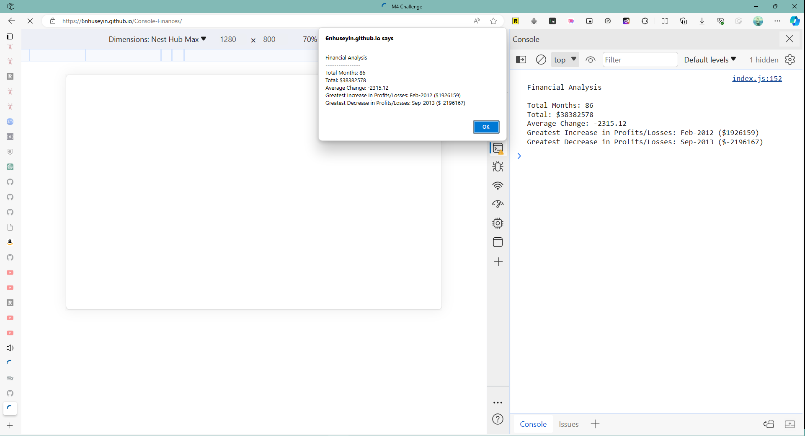

# Console-Finances

## Overview
`Console-Finances` is a JavaScript application designed to perform a financial analysis on a dataset of monthly profit and losses. It calculates the total number of months in the dataset, the net total amount of profit/losses over the period, the average change in profit/losses, and identifies the months with the greatest increase and decrease in profits.

## Features
- **Total Months Calculation**: Counts the total number of months included in the financial dataset.
- **Total Profit/Loss Calculation**: Computes the net total amount of Profit/Losses over the entire period.
- **Average Change Calculation**: Calculates the average of the changes in Profit/Losses over the entire period.
- **Greatest Increase in Profits**: Identifies the month and amount of the greatest increase in profits.
- **Greatest Decrease in Profits**: Identifies the month and amount of the greatest decrease in profits.

## Screenshot

Here's how `Console-Finances` looks like in action:

## Deployment

The application is deployed and can be viewed live at the following URL:

- [Console-Finances Live URL](https://6nhuseyin.github.io/Console-Finances)

Visit the link to see the application in action.

For the source code, visit the GitHub repository:

- [GitHub Repository](https://github.com/6nhuseyin/Console-Finances)

## Application Quality

`Console-Finances` has been developed to closely resemble the functionality outlined in the challenge instructions. It efficiently analyses financial data and displays the results both on the console and as an alert output.

## How to Use

1. Clone the repository to your local machine.
2. Open the `index.html` file in a web browser to view the application.
3. Check the alert message or open dev tools to see the console.log output of your browser

## Technologies Used

- HTML
- JavaScript
